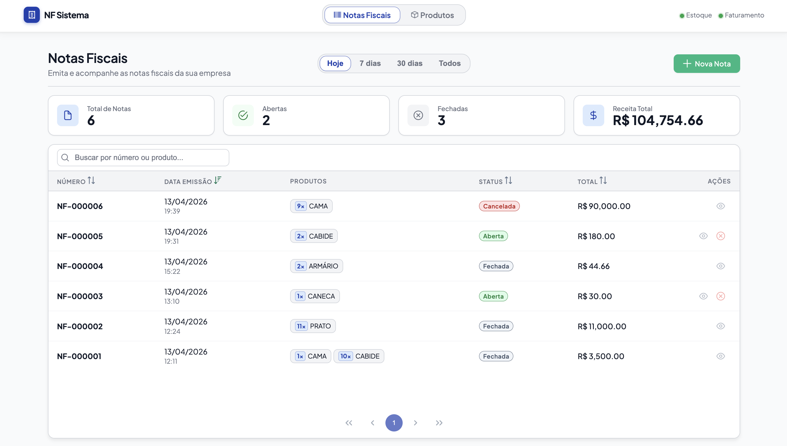
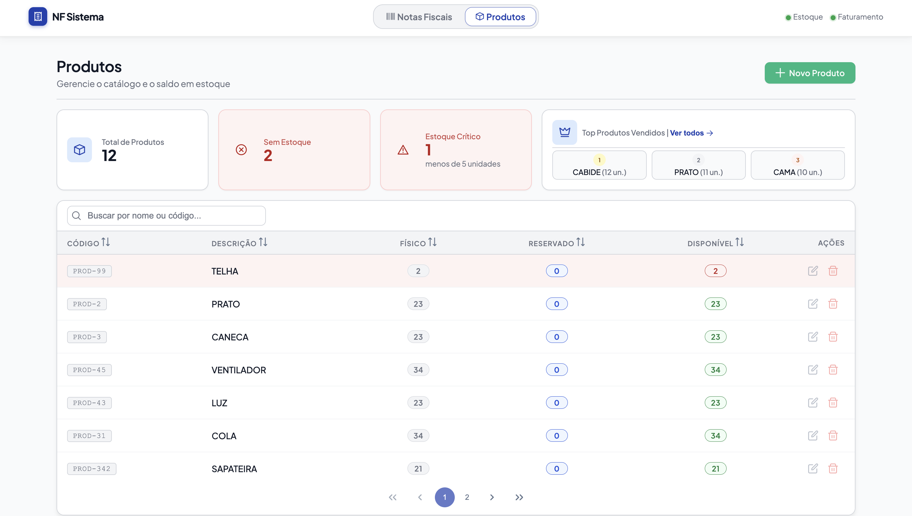

# Sistema de Emissão de Notas Fiscais

Sistema de gerenciamento de notas fiscais com arquitetura de microsserviços, desenvolvido com Angular no frontend e ASP.NET Core no backend.

<p align="center">
	
	
</p>

---

## Sumário

- [Tecnologias](#tecnologias)
- [Arquitetura](#arquitetura)
- [Pré-requisitos](#pré-requisitos)
- [Como Executar](#como-executar)
  - [Com Docker (recomendado)](#com-docker-recomendado)
  - [Sem Docker (manual)](#sem-docker-manual)
- [Configuração de Variáveis de Ambiente](#configuração-de-variáveis-de-ambiente)
- [Funcionalidades](#funcionalidades)
- [Detalhamento Técnico](#detalhamento-técnico)

---

## Tecnologias

### Backend
- **ASP.NET Core 8.0** — Web API REST
- **Entity Framework Core** — ORM e migrations
- **PostgreSQL 16** — banco de dados relacional
- **Polly** — resiliência (retry e circuit breaker)
- **FluentValidation** — validação de entrada
- **Serilog** — logging estruturado
- **Swagger** — documentação da API

### Frontend
- **Angular 21** — framework SPA
- **PrimeNG 21** — biblioteca de componentes UI
- **RxJS 7** — programação reativa
- **TypeScript** — tipagem estática
- **SCSS** — estilização com design system próprio

---

## Arquitetura

O sistema é composto por dois microsserviços independentes:

```
┌─────────────────┐         ┌───────────────────────┐
│    Frontend     │         │   FaturamentoService  │
│  Angular :4200  │──HTTP──▶│      ASP.NET :5002    │
└─────────────────┘         └──────────┬────────────┘
                                       │ HTTP (interno)
                             ┌─────────▼────────────┐
                             │   EstoqueService      │
                             │    ASP.NET :5189      │
                             └──────────┬────────────┘
                                        │
                             ┌──────────▼────────────┐
                             │      PostgreSQL        │
                             │  estoque_db            │
                             │  faturamento_db        │
                             └───────────────────────┘
```

- **EstoqueService** — gerencia produtos e controle de saldo em estoque
- **FaturamentoService** — gerencia notas fiscais e comunica com o EstoqueService ao imprimir

---

## Pré-requisitos

### Para rodar com Docker
| Ferramenta | Versão mínima | Download |
|---|---|---|
| Docker Desktop | 24+ | https://www.docker.com/products/docker-desktop |
| Docker Compose | v2 (incluso no Docker Desktop) | — |

### Para rodar sem Docker
| Ferramenta | Versão mínima | Download |
|---|---|---|
| .NET SDK | 8.0 | https://dotnet.microsoft.com/download/dotnet/8.0 |
| Node.js | 20 LTS | https://nodejs.org |
| npm | 11+ (vem com o Node) | — |
| Angular CLI | 21 | `npm install -g @angular/cli` |
| PostgreSQL | 16 | https://www.postgresql.org/download |

Para verificar se já tem as ferramentas instaladas:
```bash
docker --version
dotnet --version
node --version
npm --version
ng version
psql --version
```

---

## Como Executar

### Com Docker (recomendado)

É a forma mais simples — sobe o banco, os dois serviços e o frontend com um único comando.

**1. Clone o repositório**
```bash
git clone <url-do-repositorio>
cd Korp_Teste_Gustavo
```

**2. Configure as variáveis de ambiente**

Copie o arquivo de exemplo e preencha os valores:
```bash
cp .env.example .env
```

Edite o `.env` com suas credenciais:
```env
POSTGRES_USER=postgres
POSTGRES_PASSWORD=sua_senha_aqui
GEMINI_API_KEY=sua_chave_gemini_aqui
```

> Para obter uma chave da API Gemini, acesse [Google AI Studio](https://aistudio.google.com/app/apikey) e gere uma chave gratuita. A chave é necessária para a funcionalidade de interpretação de pedidos por linguagem natural.

**3. Suba todos os serviços**
```bash
docker-compose up --build
```

> Na primeira execução o build pode levar alguns minutos. Nas próximas será mais rápido pois as imagens ficam em cache.

**4. Aguarde todos os serviços estarem prontos**

O terminal mostrará os logs de cada serviço. Quando aparecer algo como `Now listening on: http://[::]:80` nos dois serviços de backend, a aplicação está pronta.

**5. Acesse a aplicação**

| Serviço | URL |
|---|---|
| Frontend | http://localhost:4200 |
| EstoqueService (Swagger) | http://localhost:5189/swagger |
| FaturamentoService (Swagger) | http://localhost:5002/swagger |
| PostgreSQL | localhost:5432 |

**Parar os serviços:**
```bash
docker-compose down
```

**Parar e remover os dados do banco:**
```bash
docker-compose down -v
```

---

### Sem Docker (manual)

#### 1. Banco de dados (PostgreSQL)

Crie os dois bancos de dados necessários:

```sql
CREATE DATABASE estoque_db;
CREATE DATABASE faturamento_db;
```

Ou via terminal:
```bash
psql -U postgres -c "CREATE DATABASE estoque_db;"
psql -U postgres -c "CREATE DATABASE faturamento_db;"
```

#### 2. EstoqueService

```bash
cd backend/EstoqueService
```

Configure a string de conexão em `appsettings.json`:
```json
{
  "ConnectionStrings": {
    "DefaultConnection": "Host=localhost;Port=5432;Database=estoque_db;Username=SEU_USUARIO;Password=SUA_SENHA"
  }
}
```

Execute as migrations e inicie o serviço:
```bash
dotnet ef database update
dotnet run
```

O serviço estará disponível em `http://localhost:5189`.  
Swagger em `http://localhost:5189/swagger`.

#### 3. FaturamentoService

Abra um novo terminal:
```bash
cd backend/FaturamentoService
```

Configure a string de conexão, a URL do EstoqueService e a chave da API Gemini em `appsettings.json`:
```json
{
  "ConnectionStrings": {
    "DefaultConnection": "Host=localhost;Port=5432;Database=faturamento_db;Username=SEU_USUARIO;Password=SUA_SENHA"
  },
  "EstoqueService": {
    "BaseUrl": "http://localhost:5189"
  },
  "Gemini": {
    "ApiKey": "SUA_CHAVE_GEMINI_AQUI",
    "Model": "gemini-flash-latest"
  }
}
```

> A chave Gemini também pode ser fornecida via variável de ambiente `Gemini__ApiKey=sua_chave` antes de executar `dotnet run`.

Execute as migrations e inicie o serviço:
```bash
dotnet ef database update
dotnet run
```

O serviço estará disponível em `http://localhost:5002`.  
Swagger em `http://localhost:5002/swagger`.

> **Importante:** o EstoqueService precisa estar rodando antes de iniciar o FaturamentoService.

#### 4. Frontend

Abra um novo terminal:
```bash
cd frontend
npm install
npm start
```

A aplicação estará disponível em `http://localhost:4200`.

> O Angular CLI abre o browser automaticamente. Caso não abra, acesse manualmente.

---

## Configuração de Variáveis de Ambiente

O arquivo `.env` (baseado em `.env.example`) é obrigatório para rodar com Docker. Para execução manual, os valores equivalentes devem estar no `appsettings.json` de cada serviço.

| Variável | Descrição | Obrigatório |
|---|---|---|
| `POSTGRES_USER` | Usuário do PostgreSQL | Sim |
| `POSTGRES_PASSWORD` | Senha do PostgreSQL | Sim |
| `GEMINI_API_KEY` | Chave da API Google Gemini | Sim (para funcionalidade de IA) |

**Como obter a chave Gemini:**
1. Acesse [Google AI Studio](https://aistudio.google.com/app/apikey)
2. Faça login com sua conta Google
3. Clique em "Create API Key"
4. Copie a chave gerada e cole em `GEMINI_API_KEY` no seu `.env`

> Sem a chave Gemini, o sistema inicia normalmente mas a funcionalidade de **interpretação de pedidos por linguagem natural** ficará indisponível.

---

## Funcionalidades

- **Cadastro de Produtos** — código, descrição e saldo em estoque
- **Cadastro de Notas Fiscais** — numeração sequencial, múltiplos produtos com quantidades e preços
- **Impressão de Notas** — ao imprimir, a nota é fechada e o saldo dos produtos é debitado automaticamente
- **Controle de Status** — notas abertas podem ser impressas; notas fechadas são somente leitura
- **Interpretação por Linguagem Natural (Gemini AI)** — campo de texto livre para descrever um pedido em português; o sistema usa a API Gemini para identificar produtos e quantidades automaticamente
- **Tratamento de Falhas** — retry automático e circuit breaker na comunicação entre microsserviços
- **Feedback ao usuário** — indicadores de carregamento e mensagens de erro em todas as operações

---

## Detalhamento Técnico

### Resiliência (Polly)
A comunicação do FaturamentoService com o EstoqueService usa políticas de retry e circuit breaker via Polly. Se o EstoqueService estiver indisponível, o sistema retenta automaticamente e exibe feedback adequado ao usuário.

### Validação
Todas as entradas são validadas com FluentValidation no backend antes de qualquer operação no banco de dados.

### Logging
Serilog com saída estruturada em console. Em ambiente de produção pode ser facilmente configurado para enviar logs para Seq, Elasticsearch ou outros sinks.

### Frontend — Gerenciamento de Estado
Os serviços Angular utilizam **Signals** para estado reativo e `ChangeDetectionStrategy.OnPush` em todos os componentes para máxima performance.

### Frontend — Tratamento de Erros HTTP
Um interceptor centralizado (`error-handler.ts`) categoriza os erros HTTP (timeout, rede, negócio, servidor, serviço indisponível) e traduz para mensagens amigáveis exibidas na interface.
